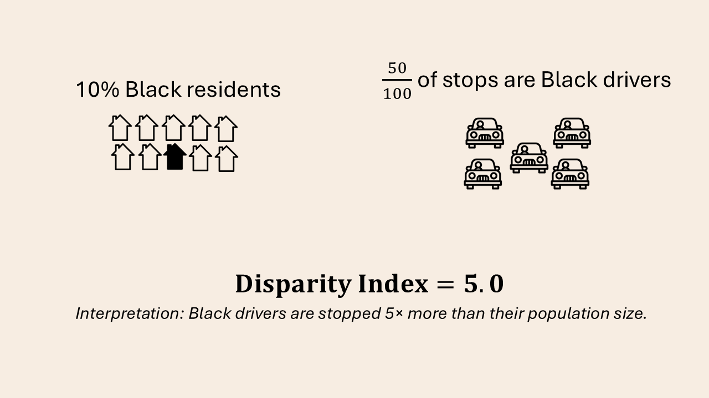

# Stops by Police (A GIS Project)

## Project Overview
This project incorporates law enforcement data along with US Census and American Community Survey data and allows for the examination of disparities in encounters with the police. The project features various techniques. First, it pulls in US Census data and then implements areal interpretation to get population estimates of the various neighborhoods of the city. Next, using the addresses of each stop with law enforcement, I identified the latitudes and longitudes for more precise analyses. The third component is creating a disparity index for each neighborhood (while taking neighborhood racial population into account); it informs us of the disparity experienced by Black drivers compared to White drivers. Finally, the results are presented in the form of a map.

## Features
- Pulls in data from US Census and American Community Survey
- Cleans and structure address data along with using Google Maps API and geopy to identify latitudes and longitudes of each stop
- Creates disparity index to examine for differences in law enforcement encounters for Black and White drivers
- Presents the disparity index of each neighborhood in a map

## Tech Stack
The following libraries and tools were used:
- Pandas
- Numpy
- Geopandas
- Shapely
- Matplotlib
- Google Maps API
- Geopy

## A Closer Look 
### Context
In many American neighborhoods, a routine traffic stop can reflect more than a broken tail-light or a speeding ticket. It can expose patterns of racial disparity in policing. In this project, we ask the question, are Black drivers getting stopped more so than White drivers? A variety of data and techniques were employed to examine this question.

### Methods and Data
To examine this question, data from different sources needed to be pulled and appended together. First, law enforcement data was cleaned and structured so that the stop associated with each address will have an accompanying latitude and longitude. Next, law enforcement data was combined with the official shapefiles, thereby letting us identify which neighborhood did each stops occur in. 

#### Areal Interpolation
Meanwhile, demographic details such as population of each neighborhood and racial population makeup of each neighborhood is pulled from the Census. However, this data was only formatted in the form of census tract and not each neighborhood. To resolve this, I conducted areal interpolation, a method used to estimate data from one set of geographic zone to another set. In this case, I was estimating the demographic values of each neighborhood from census tract since I did not have access to neighborhood population data. For example, in attempting to figure out the demographic details of Neighborhood J, I take the proportion of census tract A that overlaps in Neighborhood J and combined it with the proportion of census tract C (80%), census tract D (94%), and census tract E (55%) that also overlapped in Neighborhood J. The combination of these tract's proportions are then used as the estimates for the neighborhood's demographic estimates. Finally, I combined this areal interpolated data with the law enforcement data.

  
  
  
  

  

#### A Measure of Disparity
To assess disparity, I created a disparity index. It is defined as the vehicle stop rate experienced by a given racial group (total number of stop for a given group in a neighborhood divided by all stops in the neighborhood) divided by the population proportion of that given group (total number of individuals of a given group in a neighborhood divided by total population in the neighborhood). By defining the index this way, we are accounting for a given racial group's population size in each neighborhood.

##### An Example 
For example, if a given neighborhood has 10% of Black residents and that 50 out of 100 stops in that neighborhood are Black drivers, we will have a disparity index of 5.0. The way to interpret this is the Black drivers are stopped 5 times more than their population size in that given neighborhood. 

#### Main Findings
Looking across 150 neighborhoods in this city, we found that Black drivers do indeed experience more frequent stops. The mean disparity index experienced by Black individuals across all neighborhoods was at 9.50, significantly higher than for White individuals (0.94). 

Another way to look at whether disparity exists is to compare how many neighborhoods Black drivers get stopped more than White drivers. It is noted that there are more neighborhoods where Black drivers get stopped more often than their White counterparts.

Below, I present the raw number of stops experienced by Black and White drivers in all neighborhoods while accounting for the percentage of their respective populations. As you can see in this map, Black drivers are stopped a lot more in White dominant neighborhoods than White drivers being stopped in Black dominant neighborhood. 

### Conclusion
This project had identified that disparity exists in the context of Black and White drivers of this given city. Given that this is the case, there are several things that law enforcement can do to remedy this issue. One example is to implement anti-bias training. This type of training can help reduce the effects of unconscious biases that influences their decisions and behavior on the job, especially in high-stress situations. This law enforcement agency needs to reestablish trust with civilians. 

